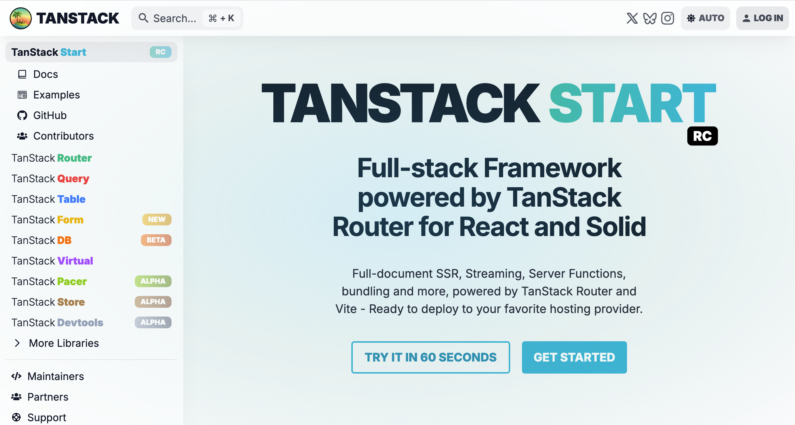
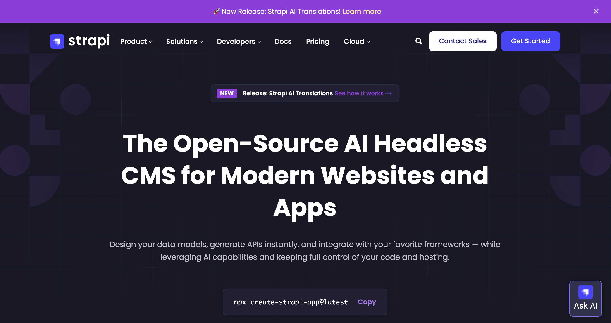

## What We Are Going To Build

In this tutorial we will learn everything you need to know to get Started with TanStack Start with Strapi.

Before diving into the lesson, let's take a look at what we are going to build.

# TanStack Start + Strapi Full-Stack Starter

A comprehensive full-stack starter project combining [TanStack Start](https://tanstack.com/start) with [Strapi](https://strapi.io/) headless CMS. 

In this project we will implement authentication, search, comments system, and more.

## 🎯 Project Overview

This project showcases a complete blog application with authentication, comments, search, and content management. 

It's designed as a tutorial foundation for learning TanStack Start with Strapi CMS integration.


### What's Built

**Frontend Features:**
- ✅ Modern blog with article listing and detail pages
- ✅ User authentication (local signup/signin + GitHub OAuth)
- ✅ Session management with HTTP-only cookies
- ✅ Full CRUD comments system on articles
- ✅ Real-time search with URL state management
- ✅ Pagination with URL-based navigation
- ✅ Theme switcher (light/dark/system)
- ✅ Responsive design with mobile navigation

**Backend Features:**
- ✅ Strapi 5 CMS with custom content types
- ✅ Custom API routes and controllers
- ✅ User authentication with JWT
- ✅ Social OAuth integration (GitHub)
- ✅ Comment system with user relations
- ✅ Search and filtering capabilities
- ✅ SQLite database (production-ready, configurable)

## 🏗️ Tech Stack



### Frontend (Client)
- **TanStack Start** - Full-stack React framework with SSR
- **React 19** - Latest React with modern features
- **TypeScript** - Full type safety
- **TanStack Router** - File-based routing with type-safe navigation
- **TanStack Form** - Advanced form handling with Zod validation
- **TanStack Query** - Powerful data fetching and caching
- **Strapi SDK** - Official SDK for Strapi integration
- **Tailwind CSS 4** - Utility-first CSS framework
- **ShadCN UI** - Accessible component primitives
- **Lucide React** - Beautiful icon library
- **Vite** - Next-generation frontend tooling



### Backend (Server)
- **Strapi 5** - Headless CMS
- **SQLite** - Lightweight, file-based database (configurable to PostgreSQL/MySQL)
- **Users & Permissions** - Built-in authentication plugin
- **Node.js** - JavaScript runtime

## 📁 Project Structure

```
strapi-tanstack-start-starter/
├── client/                      # TanStack Start frontend
│   ├── src/
│   │   ├── routes/             # File-based routing
│   │   │   ├── _auth/          # Auth routes (signin, signup)
│   │   │   ├── articles/       # Blog routes
│   │   │   │   ├── index.tsx   # Article listing with search
│   │   │   │   └── $slug.tsx   # Article detail with comments
│   │   │   └── index.tsx       # Home page
│   │   ├── components/         # React components
│   │   │   ├── ui/            # Reusable UI components
│   │   │   ├── custom/        # Feature components
│   │   │   └── blocks/        # Content blocks
│   │   ├── data/
│   │   │   └── server-functions/ # TanStack Start server functions
│   │   │       ├── auth.ts       # Authentication logic
│   │   │       ├── articles.ts   # Article data fetching
│   │   │       └── comments.ts   # Comments CRUD
│   │   └── lib/               # Utilities and helpers
│   └── package.json
├── server/                      # Strapi CMS backend
│   ├── src/
│   │   ├── api/               # API definitions
│   │   │   ├── article/      # Article content type
│   │   │   ├── comment/      # Comment content type
│   │   │   │   ├── controllers/ # Custom controllers
│   │   │   │   ├── routes/     # Custom routes
│   │   │   │   └── middlewares/ # Custom middleware
│   │   │   ├── author/       # Author content type
│   │   │   └── tag/          # Tag content type
│   │   └── config/           # Strapi configuration
│   └── package.json
├── seed-data.tar.gz           # Sample data for seeding
└── package.json               # Root scripts

```


## 🔐 Authentication

### Local Authentication
1. Navigate to `/signup` to create an account
2. Use `/signin` to log in
3. Session stored in HTTP-only cookies (7-day expiration)

### GitHub OAuth
1. Configure GitHub OAuth in Strapi admin (`/admin/settings/users-permissions/providers`)
2. Add GitHub Client ID and Secret
3. Set callback URL: `http://localhost:1337/api/connect/github/callback`
4. Use the "Sign in with GitHub" button on signin page

## 📊 Content Types (Strapi)

### Article
- Title, description, slug
- Rich text content
- Featured image
- Author relation
- Tags (many-to-many)
- Related articles
- Dynamic content blocks

### Comment
- Content (max 1000 characters)
- User relation (oneToOne)
- Article reference
- Timestamps

### Author
- Name, email
- Avatar
- Articles relation

### Tag
- Name
- Articles relation

## 🎨 UI Components

Built with **Radix UI** and **Tailwind CSS**:
- Navigation (desktop + mobile)
- Cards, Buttons, Inputs
- Dropdown menus
- Modals/Dialogs
- Avatar components
- Theme toggle
- Pagination
- Search bar

## 🔄 Data Flow

```
User Action → TanStack Form
    ↓
Server Function (client/src/data/server-functions/)
    ↓
Strapi SDK Request
    ↓
Strapi API (server/src/api/)
    ↓
Custom Controller/Route (if needed)
    ↓
Strapi Service Layer
    ↓
Database (SQLite)
    ↓
Response → TanStack Query Cache
    ↓
React Component Update
```

## 📚 Tutorial Roadmap

This project is designed to teach:

1. **Setup & Configuration**
   - Setting up TanStack Start
   - Configuring Strapi CMS
   - Environment variables and deployment

2. **Authentication**
   - User registration and login
   - Session management
   - Social OAuth integration
   - Protected routes

3. **Content Management**
   - Creating Strapi content types
   - Custom controllers and routes
   - Relationships and population
   - Media handling

4. **Frontend Integration**
   - Strapi SDK setup
   - Server functions
   - Type-safe data fetching
   - Error handling

5. **Advanced Features**
   - Comments system with CRUD
   - Real-time search
   - URL-based state management
   - Theme system

6. **Production Deployment**
   - Environment configuration
   - Database migration
   - Security best practices
   - Performance optimization

## 🔧 Environment Variables

### Client (`client/.env`)
```env
VITE_STRAPI_URL=http://localhost:1337
SESSION_SECRET=your-secret-key-here
```

### Server (`server/.env`)
```env
# Strapi automatically generates these on first run
APP_KEYS=...
API_TOKEN_SALT=...
ADMIN_JWT_SECRET=...
TRANSFER_TOKEN_SALT=...
JWT_SECRET=...
```

## 🚀 What's Next?

Extend this starter with:
- [ ] Article categories
- [ ] User profiles
- [ ] Comment replies (nested comments)
- [ ] Like/favorite system
- [ ] Email notifications
- [ ] Advanced search filters
- [ ] Image upload in comments
- [ ] Markdown editor
- [ ] RSS feed
- [ ] SEO optimization

## 📖 Resources

- [TanStack Start Documentation](https://tanstack.com/start/latest)
- [TanStack Router Documentation](https://tanstack.com/router/latest)
- [TanStack Form Documentation](https://tanstack.com/form/latest)
- [TanStack Query Documentation](https://tanstack.com/query/latest)
- [Strapi Documentation](https://docs.strapi.io/)
- [Strapi SDK Documentation](https://docs.strapi.io/dev-docs/sdk)
- [Tailwind CSS Documentation](https://tailwindcss.com/)
- [Radix UI Documentation](https://www.radix-ui.com/)


## 🤝 Contributing

Contributions are welcome! This project serves as a learning resource for the community.

---

**Built with ❤️ for the TanStack and Strapi communities**
